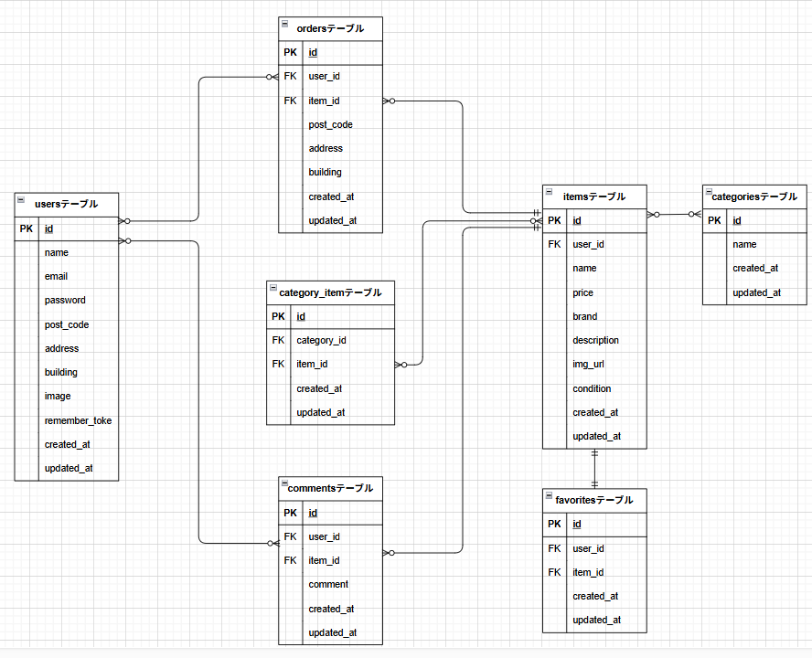

# coachtech_flea-market-app

## 環境構築

**Docker ビルド**

1. `git clone git@github.com:yutaka58/coachtech_flea-market-app.git`
2. `cd coachtech_flea-market-app`
3. DockerDesktop アプリを立ち上げる
4. `docker-compose up -d --build`

**Laravel 環境構築**

1. `docker-compose exec php bash`
2. `composer install`

3. 「.env.example」ファイルを 「.env」ファイルに命名を変更。または、新しく.envファイルを作成

```bash
mv .env.example
または
cp .env.example .env
```

4. .envに以下の環境変数を追加

```text
DB_CONNECTION=mysql
DB_HOST=mysql
DB_PORT=3306
DB_DATABASE=laravel_db
DB_USERNAME=laravel_user
DB_PASSWORD=laravel_pass
```

5. Windows環境の場合は、「全てのファイル」と「.env」ファイルの権限変更。
   `sudo chmod -R 777 src/*`、 `sudo chmod -R 777 src/.env`

6. アプリケーションキーの作成

```bash
php artisan key:generate
```

7. マイグレーションの実行

```bash
php artisan migrate
```

8. シーディングの実行

```bash
php artisan db:seed
```

9. シンボリックリンク作成

```bash
php artisan storage:link
```

## 使用技術(実行環境)

- PHP8.1.33
- Laravel8.83.29
- MySQL8.0.26

## ER 図



## URL

- 開発環境：http://localhost/
- phpMyAdmin:：http://localhost:8080/

## 備考

1. マイページの「出品した商品」「購入した商品」に表示された
   商品の詳細画面が開けなくとも良いことコーチと確認済み。
